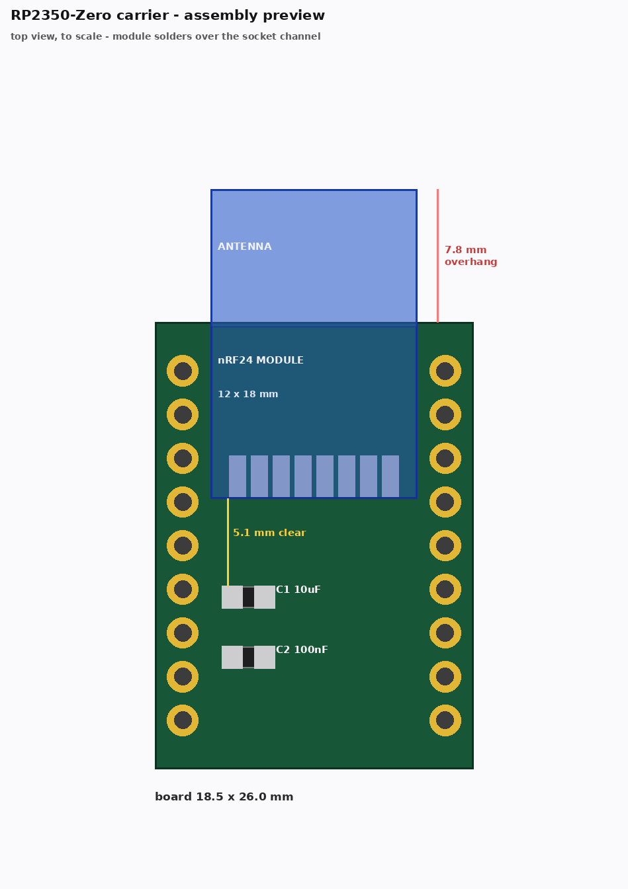
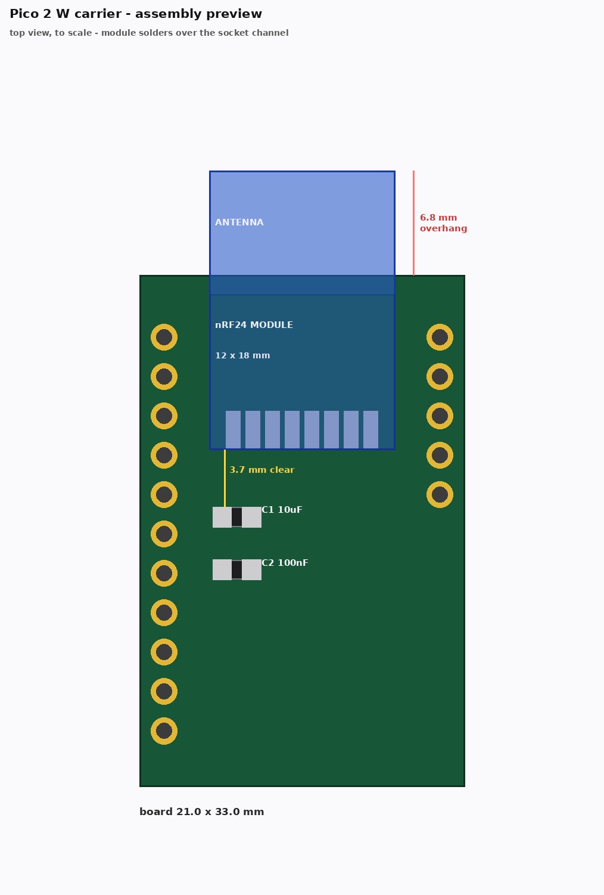
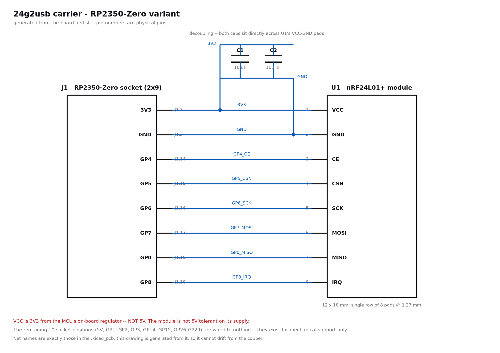
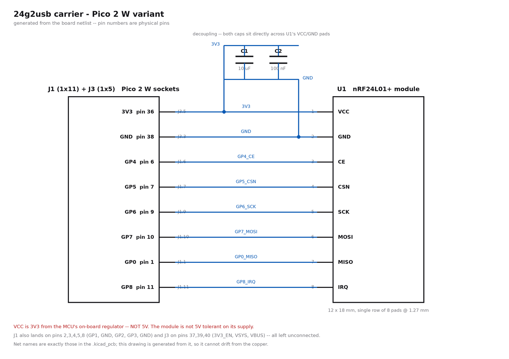

# nRF24L01+ Carrier PCB (RP2350-Zero / Pico 2 W)

Two carrier PCBs that hold an nRF24L01+ mini SMD module and receive a host MCU board on header
sockets, for the [24g2usb](../../apps/24g2usb.md) app (SF30 2.4G wireless receiver). Pick the one
that matches the board you have:

- **[24g2usb_rp2350zero](../../../hardware/24g2usb_rp2350zero/)** -- Waveshare RP2350-Zero,
  18.5x26mm (the Zero's own footprint, plus a comfortable margin)
- **[24g2usb_pico2w](../../../hardware/24g2usb_pico2w/)** -- Raspberry Pi Pico 2 W (or Pico / Pico W
  / Pico 2), 21x33mm, as small as the used pins allow

> **Neither board has been fabricated or tested yet.** Both are DRC-clean and their netlists are
> asserted against the firmware's wiring table, but no physical board has been built from these
> files. The **Pico 2 W variant is the less settled of the two**: its module antenna overhangs the
> same edge the Pico's USB-C connector occupies, and that clearance has only been checked against
> the 3D render, not a real cable. Treat the RP2350-Zero board as the better-understood option and
> both as a first spin.

Both are bare 2-layer PCBs you order from a fab (JLCPCB or similar) and hand-solder: the module,
the socket(s), and two decoupling caps (both boards). Full parts lists, fab order settings, and
per-board assembly notes are in each board's own README -- this page covers the parts that are the
same for both, and the firmware/pairing steps once either is built.

Neither board needs a KiCad GUI step before ordering -- `make gerbers zip` in each board's
directory produces an upload-ready gerber/drill zip directly.

## Wiring (both boards, fixed by the firmware -- see [24g2usb wiring](../../apps/24g2usb.md#wiring))

| nRF24L01+ | Signal | Notes |
|-----------|--------|-------|
| VCC | 3V3 | **Not 5V** -- the module is not 5V tolerant on its supply |
| GND | GND | |
| CE | GPIO 4 | |
| CSN | GPIO 5 | |
| SCK | GPIO 6 | `spi0` SCK |
| MOSI | GPIO 7 | `spi0` TX |
| MISO | GPIO 0 | `spi0` RX |
| IRQ | GPIO 8 | Required -- the receiver is interrupt-driven |

Both carriers wire the module to these exact pins; the sockets just get you there without flying
leads.


### What it looks like assembled





Drawn to scale from the board files. The module's body runs *away* from the caps, so it never
covers C1/C2 -- there is 5.1mm of clear board between the module edge and C1 on the RP2350-Zero
board, 3.7mm on the Pico 2 W board. The antenna end overhangs the outline (7.8mm and 6.8mm
respectively) so it radiates into free air rather than over copper or FR4.

### Circuit





Eight nets, no active parts. Both figures are generated from the boards by
[`hardware/doc_images.py`](../../../hardware/doc_images.py), reading the net attached to each pad,
so they cannot drift from the copper.

## Mounting: below or above the host board

Both carriers can go on either side of the host MCU board, your choice:

- **Carrier below the host board**: solder female sockets to the carrier's top face; the host
  board (with its normal male header pins) plugs in from above.
- **Carrier above the host board**: solder male header pins pointing down out of the carrier's
  bottom face instead, and plug the carrier into a host board that has female sockets fitted.
  This orientation gives the module's antenna clear air above it, with nothing overhead.

Either way the carrier's top face still points up and the hole-to-net mapping is unchanged --
**never flip the carrier over to mate it**. That mirrors the two header rows and would drive 3V3
into the SPI pins. Both boards silkscreen a "USB(-C) END" marker and a pin-1 marker on **both**
faces (mirrored on the back) specifically so this can't be gotten wrong by feel while soldering
from underneath.

## Ordering

1. Read the board's own README (fab settings, BOM, known limitations). `make -C hardware/<board>
   all` regenerates the board from `generate.py`, runs DRC, and exports gerbers/drill/BOM/
   positions/renders -- no KiCad GUI step required.
2. Print the board's `fab/*-top-1to1.pdf` at 100% scale and check it against your actual host
   board and nRF24 module with calipers before ordering -- the one thing the software can't
   verify for you, and module pad geometry varies between sellers. The print includes the
   module's true 12x18mm body (on the F.Fab reference layer, so the antenna overhang -- which is
   real on both boards -- is visible and checkable, not just the pads).
3. **Check your module's pad order.** The boards expect, along the row with the antenna pointing
   away from you: `+3.3V, GND, CE, CSN, SCK, MOSI, MISO, IRQ`. This matches the vendor drawing for
   the common 12x18mm module ([Sunrom model
   3962](https://www.sunrom.com/p/rf-module-2-4ghz-nrf24l01-smd) -- 12x18mm, 1.27mm pitch, first
   pad 1.6mm from the edge), which is what the footprint was built against. But these modules are
   **not standardised between sellers** and carry no silkscreen on the pad row, so if yours came
   from a different source, verify before ordering: set a meter to continuity, put one probe on
   any bare ground on the module (the crystal can, or the ground fill around the antenna), and
   probe each pad. Exactly one should beep, and it must be the **second** pad from the +3.3V end.
   If GND lands anywhere else -- most commonly at the far end of the row -- that module needs a
   different footprint. A swapped VCC/GND destroys the module the first time it is powered.
4. Upload `fab/*-gerbers.zip` to your fab of choice as a bare (non-assembled) 2-layer board.

## Assembly

Same order for both boards: **module first** (tack one corner, check alignment, finish
soldering), **then C1/C2 decoupling caps** (both boards have them, right next to the module's
VCC/GND pads), **then the socket(s)/header(s) last** (tallest parts, easiest to knock loose while
soldering everything else).

## Build and Flash

```bash
# RP2350-Zero carrier
make 24g2usb_rp2350zero
make flash-24g2usb_rp2350zero

# Pico 2 W carrier
make 24g2usb_pico2_w
make flash-24g2usb_pico2_w
```

Output: `releases/joypad_os_<commit>_24g2usb_<board>.uf2`. Flash by holding BOOTSEL while plugging in
USB, or drag-and-drop the `.uf2` onto the `RPI-RP2` drive.

## Pairing

Hold **BOOTSEL** for about 1.5 seconds to start pairing. The board LED blinks fast while looking
for a controller, then goes solid once an SF30 2.4G controller links. See
[24G Input -- Pairing](../../input/24g.md#pairing) for the full rendezvous, and the
[24g2usb app docs](../../apps/24g2usb.md) for LED states, USB output modes, and BOOTSEL controls.

## Testing

1. Plug the flashed board into a PC.
2. Pair an 8BitDo SF30 2.4G controller (hold BOOTSEL ~1.5s, then power on the controller).
3. Open a gamepad tester and confirm all buttons/sticks register.
4. If nothing pairs: re-check the fit-check step actually matched your module's pinout (VCC, GND,
   CE, CSN, SCK, MOSI, MISO, IRQ in that order along the row) -- a swapped VCC/GND is the most
   common hand-soldering mistake on these modules and won't always kill the board outright.

## Troubleshooting

| Symptom | Likely cause |
|---------|--------------|
| Board doesn't enumerate at all | Bad USB cable/port; re-check 3V3 isn't shorted to GND at the module |
| Enumerates but never pairs | Module VCC/GND swapped, or a cold solder joint on CE/CSN/IRQ (interrupt-driven -- IRQ open or floating means the receiver never wakes) |
| Pairs, then drops | Missing/bad decoupling -- check C1/C2 (both boards have them, right at the module's VCC/GND pads) |
| LED never leaves slow-blink | No controller found -- confirm the SF30 2.4G controller is actually in pairing mode, not just powered on |
