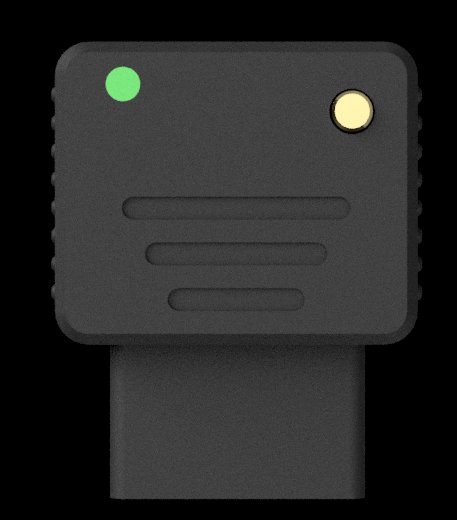
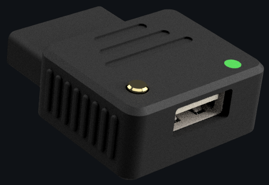

# USB4NEO User Guide

  
  

## What is USB4NEO?

USB4NEO is a small adapter that lets you use modern USB controllers, gamepads, and mice with SNK Neo Geo consoles (both AES and CD), MVS boards and Neo Geo-compatible hardware including SuperGuns. It plugs directly into your Neo Geo's DB15 controller port and translates input from any compatible USB device into the signals your hardware understands.

---

## What's in the Box

- USB4NEO adapter

---

## Connecting USB4NEO

1. Plug USB4NEO directly into your Neo Geo's controller port.
2. Plug your USB controller or mouse into the USB-A port on USB4NEO.
3. Power on your console.

> **Note:** USB4NEO is powered by your Neo Geo controller port. No separate power supply is needed.

---

## LED Colors

The LED on USB4NEO tells you what's going on at a glance.

| Color | Meaning |
|-------|---------|
| Breathing (any color) | Waiting for a USB device to connect |
| **Green** | Pad mode active |
| **Red** | Custom Controls mode active |
| **Blue** | Mouse Joystick mode active (mouse connected) |
| **Yellow** | Mouse Spinner/Paddle mode active (mouse connected) |
| **Purple** | DPI adjustment mode active |
| **White** | Button remapping sequence in progress |

---

## Using a Gamepad or Joystick

USB4NEO works with most USB gamepads including Xbox, PlayStation, Nintendo Switch, and 8BitDo controllers, as well as most generic USB HID gamepads.

### Pad Mode (Green LED)

Pad mode provides two optimized button layouts for gamepad users.

| Profile | LED Blinks | Button Layout |
|---------|-----------|---------------|
| **Pad A** | 1 blink | Cross→A, Circle→B, Square→C, Triangle→D, R1→P5, L1→P6 |
| **Pad B** | 2 blinks | Square→A, Cross→B, Triangle→C, Circle→D, R1→P5, L1→P6 |

**To switch between Pad A and Pad B:**
1. Hold **Select** for 2 seconds to enter Navigation Mode (all button output is suppressed during this time).
2. Tap **D-pad Up or Down** to cycle between profiles. The LED blinks to confirm which profile is active.
3. Release **Select** to save and exit.

---

## Custom Controls Mode (Red LED)

Custom Controls mode lets you remap all six Neo Geo face buttons to any button on your USB controller. Your mapping is saved to the adapter and persists across power cycles.

**To enter Custom Controls mode:**
1. Hold **Select** for 2 seconds to enter Navigation Mode.
2. Tap **D-pad Left or Right** to switch to Red (Custom Controls).
3. Release **Select**.

**To remap your buttons:**
1. While in Custom Controls mode (Red LED), hold **Select** for 2 seconds to enter Navigation Mode.
2. Press **Start** to begin the remap sequence. The LED turns **White**.
3. Press your buttons one at a time in this order:
   - Slot 1 → Neo Geo **A**
   - Slot 2 → Neo Geo **B**
   - Slot 3 → Neo Geo **C**
   - Slot 4 → Neo Geo **D**
   - Slot 5 → Neo Geo **Button 5**
   - Slot 6 → Neo Geo **Button 6**
4. You may map as few or as many buttons as you like. Release **Select** at any time to save.

The LED returns to Red and your mapping is saved automatically. To remap again, repeat the process — the remap sequence always starts fresh.

> **Note:** To switch back to Pad mode from Custom Controls, hold Select for 2 seconds and tap D-pad Left or Right to cycle to Green.

---

## Turbo Fire

USB4NEO includes hardware turbo fire at 10Hz. Turbo is toggled per-button and is not saved across power cycles.

**To enable turbo on a button:**
1. Hold **Select** for 2 seconds.
2. Tap the face button you want turbo on. The LED blinks twice to confirm.
3. Release **Select**.

**To disable turbo on a button:**
- Repeat the same steps.

The LED double-blinks every 3 seconds while turbo is active as a reminder.

> **Note:** Turbo is cleared automatically when you switch profiles or modes.

---

## Using a Mouse or Trackball

USB4NEO automatically detects a connected USB mouse or trackball. The LED switches to Blue (Mouse Joystick mode) or Yellow (Mouse Spinner/Paddle mode) depending on your last saved setting.

### Mouse Joystick Mode (Blue LED)

Ideal for games that use directional input such as Puzzle Bobble.

| Mouse Input | Neo Geo Output |
|-------------|---------------|
| Move Left/Right | Left / Right |
| Move Up/Down | Up / Down |
| Left button | A button |
| Right button | Start |
| Middle button | Select (Coin) |

### Mouse Spinner/Paddle Mode (Yellow LED)

Designed for games with spinner or paddle support such as Hypernoid. Mouse X-axis movement is translated into the Neo Geo's 7-bit binary counter protocol.

| Mouse Input | Neo Geo Output |
|-------------|---------------|
| Move Left/Right | Spinner counter (7-bit) |
| Left button | D button |
| Right button | Start |
| Middle button | Select (Coin) |

> **Note:** In Spinner mode, Select+Start and A+B+C+Select/Start combinations are automatically blocked to prevent accidentally triggering the UniBIOS in-game menu.

### Switching Mouse Modes

Press the **BOOTSEL button** on the adapter to toggle between Mouse Joystick (Blue) and Mouse Spinner/Paddle (Yellow) modes. Your selection is saved automatically.

---

## Adjusting Mouse Speed (DPI)

If your mouse or trackball feels too fast or too slow, you can adjust the sensitivity without any tools or software. USB4NEO uses a DPI divisor to scale mouse movement — a lower divisor means faster movement, a higher divisor means slower movement. The divisor range is **1–8**, with a default of **2**.

**How to adjust:**
1. Connect your USB mouse (LED shows Blue or Yellow).
2. **Hold the BOOTSEL button for 2 seconds.** The LED turns **Purple** to confirm you're in DPI adjustment mode. Mouse movement continues to work so you can feel the change in real time.
3. While the LED is purple:
   - **Left mouse button** → faster (decreases the divisor)
   - **Right mouse button** → slower (increases the divisor)
4. **Tap the BOOTSEL button** to exit and save your setting.

The LED returns to your mouse mode color and your new setting is saved automatically.

> **Note:** DPI is shared between Mouse Joystick and Spinner/Paddle modes.

---

## Updating Firmware

1. Download the latest `.uf2` for USB4NEO from [Releases](https://github.com/thgill/RetroFrog-USB-Adapters/releases)
2. **Disconnect USB4NEO from your Neo Geo first**
3. Hold the **BOOTSEL button** and connect a USB-A male-to-male cable from USB4NEO to your computer
4. Drag the `.uf2` file onto the `RP2350` drive that appears
5. Done — the drive ejects and your adapter is running the new firmware

> **Note:** USB4NEO resets its settings to defaults after a firmware update. Your profile selection, custom button mapping, and DPI settings will need to be reconfigured.

> **Important:** You MUST use a USB-A male-to-male cable for firmware updates. A USB-A to USB-C cable will NOT work. If your computer only has USB-C ports, use a female USB-A to male USB-C adapter — these have the correct resistors and are designed for this purpose.

---

## Troubleshooting

**The adapter doesn't seem to be doing anything.**
Check that the LED is on. If the LED is breathing, the adapter is waiting for a USB device to be connected.

**My controller isn't being recognized.**
Most modern gamepads work out of the box. Some very old or unusual USB devices may not be supported. Try a different controller.

**Buttons are in the wrong positions.**
You may be in the wrong profile. Hold Select for 2 seconds and tap D-pad Up/Down to cycle through Pad A and Pad B, or switch to Custom Controls mode to map buttons to your preference.

**The UniBIOS menu keeps appearing.**
This is usually caused by holding Select too long while playing. USB4NEO suppresses the Select button from reaching the console after 1.5 seconds of holding to help prevent this. In Mouse Spinner mode, Select+Start and A+B+C+Select/Start combinations are blocked automatically.

**The mouse cursor or spinner moves in the wrong direction.**
In Mouse Joystick mode, mouse X-axis controls Left/Right. In Mouse Spinner mode, mouse X-axis controls the spinner counter direction. If the direction feels reversed, try moving the mouse the opposite way or adjust your grip.

**Mouse sensitivity is too high or too low.**
Use the DPI adjustment system — hold BOOTSEL for 2 seconds, adjust with left/right mouse buttons, tap BOOTSEL to save.

**Turbo fire seems to have stopped working.**
Turbo is cleared when you switch profiles or modes, and is not saved across power cycles. Re-enable it via Navigation Mode (hold Select 2 seconds, tap the button you want turbo on).

**I accidentally entered Custom Controls mode and my buttons stopped working.**
Hold Select for 2 seconds to enter Navigation Mode and tap D-pad Left/Right to switch back to Green (Pad mode).

---

## Technical Notes

- USB4NEO remembers your mode (Pad/Custom Controls), active profile, custom button mapping, mouse mode, and DPI setting across power cycles.
- Turbo fire is NOT saved across power cycles and resets to off on each boot.
- The USB controller port on USB4NEO has a polyfuse protecting your Neo Geo from excessive current draw. Avoid plugging in controllers with internal batteries that may charge via USB, as this can exceed the current limit and trip the polyfuse. If this happens, power off your system, disconnect the controller, and wait 30 minutes before powering on again.
- USB4NEO is powered entirely by the Neo Geo controller port. No external power is required.
